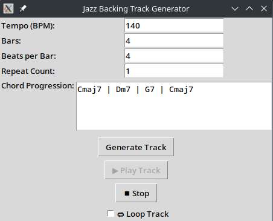

# 🎷 Jazz Backing Track Generator

A Python application that generates customizable jazz backing tracks using MIDI synthesis and SoundFonts. Includes a simple GUI for tempo, chord progression, and looping — complete with real-time audio playback.

---

## 🚀 Features

- 🧠 Chord progression parsing (jazz-style notation)
- 🎸 Auto-generated bass, piano, and drum tracks
- 🔁 Loop support (both via playback and MIDI extension)
- 🖥️ GUI built with Tkinter
- 🎧 Audio rendering from MIDI via FluidSynth
- ▶️ Live playback and stop controls
- 💾 Export to MIDI and WAV

---

## 🛠 Requirements

Python 3.8+

Install dependencies (preferably in a virtual environment):

```bash
pip install -r requirements.txt
```

---

### 🔧 Required SoundFont

This project uses the **FluidR3 General MIDI SoundFont** for audio rendering.

#### 📥 Installation (Linux/Debian):

```bash
sudo apt install fluid-soundfont-gm
```

This will install the SoundFont to:

```
/usr/share/sounds/sf2/FluidR3_GM.sf2
```

If you're using a different `.sf2` file or are on another OS, update the `SF2_PATH` in:

- `main.py`
- `gui/app.py`

---

## 🚀 How to Run

### 🖥️ GUI Mode

Launch the graphical interface:

```bash
python3 -m gui.app
```

This opens a GUI where you can:
- Set **tempo**, **bars**, and **beats per bar**
- Input jazz-style progressions:  
  `Cmaj7 | Dm7 | G7 | Cmaj7`
- Set how many times to **repeat** the progression
- Click **Generate Track** to create and export a MIDI + WAV
- Click **▶️ Play Track** to hear it
- Use **🔁 Loop** toggle for continuous playback
- Click **⏹️ Stop** to stop audio

> ⚠️ Make sure your SoundFont path is set correctly in `app.py`.

---

### 🧪 CLI Mode

You can also run the tool via command line:

```bash
python3 main.py
```

You'll be prompted for:
- Tempo (BPM)
- Chord progression
- Time signature and bar count

Or you can toggle preset mode in `main.py`:

```python
USE_PRESET = True
```

---

## 📂 Project Structure

```
jazz-backing-track-generator/
├── main.py                   # CLI runner
├── requirements.txt
├── README.md
│
├── gui/
│   └── app.py                # Tkinter GUI
│
├── engine/
│   ├── generator.py          # Generates PrettyMIDI object
│   ├── renderer.py           # Renders MIDI to WAV
│   └── midi_writer.py        # Saves MIDI to file
│
├── instruments/
│   ├── bass.py               # Bass track logic
│   ├── piano.py              # Piano voicings
│   ├── drums.py              # Drum pattern generator
│   └── metronome_track.py    # Optional MIDI click track
│
├── chords/
│   ├── parser.py             # Parses chord progression strings
│   └── theory.py             # Root note + note map helpers
```

---

## 💡 Planned Features

- Walking bass line generator 🎸
- Smarter piano voicings and voice leading 🎹
- Style selection (swing, bossa, funk...) 🎵
- Drum fills and rhythmic variation 🥁
- Instrument toggles in GUI 🎛
- Stem exporting (separate files per instrument) 🎚
- SoundFont picker and preferences support

---

## 🖼 GUI Preview



---

## 📄 License

MIT — free to use, share, and remix.

---

## 🙌 Credits

- [pretty_midi](https://github.com/craffel/pretty-midi)
- [FluidSynth](https://www.fluidsynth.org/)
- [pygame](https://www.pygame.org/)
- Jazz harmony inspiration from real cats 🎶🐾